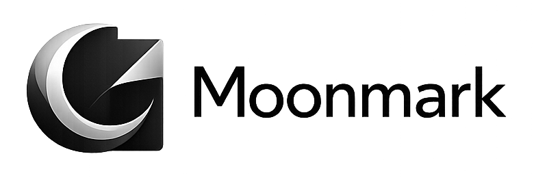

# Moonmark



Moonmark is a Windows-first, viewer-first Markdown application. It is one native process built with Rust, C++20, Qt 6 Widgets, and QTextDocument. Linux is the secondary desktop target; Android remains later work. Moonmark contains no browser engine, web frontend, local server, CLR, JVM, or Node.js runtime.

Current development baseline: `0.1.0-dev.1`.

## Architecture

```text
Markdown source
  -> Rust / Comrak semantic model
  -> Rust framework-neutral presentation commands
  -> versioned C ABI
  -> C++ / Qt Widgets adapter
  -> native QTextDocument
```

Rust owns file loading, Comrak parsing, semantic/presentation models, syntax classification, image policy/decoding/cache, diagnostics, and framework-neutral window state. C++ owns the Qt widget shell, native QTextDocument construction, selection/clipboard interaction, document layout, and Windows presentation integration. The boundary transfers UTF-8 JSON, IDs, owned byte buffers, counters, and function pointers; it does not use a second process or network IPC.

The New Moon interface is broad, desktop-first, and achromatic. Syntax highlighting is the only color exception and deliberately avoids blue, cyan, teal, navy, and blue-gray.

Moonmark is file-oriented rather than vault-oriented: it reads an ordinary Markdown file and releases the read handle. Relative images resolve from that document; valid parent, absolute, and `file:///` paths are allowed after canonicalization. Remote images remain disabled.

## Build and run

On Windows, install Rust 1.94+ with the MSVC target and a C++20 MSVC toolchain. Then either set `MOONMARK_QT_DIR`/`QTDIR` to a Qt 6 Widgets SDK or bootstrap the tested project-local Qt 6.11.2 SDK:

```powershell
pwsh -File scripts/bootstrap_qt.ps1
cargo run
cargo run -- fixtures\moonmark-visual-test.md
cargo check
cargo test
cargo build --release
```

Cargo compiles the C++ adapter and stages the required dynamic Qt libraries. It does not invoke CMake, `dotnet`, NuGet, Node.js, or a browser toolchain.

Generate repeatable stress inputs and run the headless Rust benchmark with:

```powershell
cargo run --bin generate_stress_fixture
cargo run --release --bin renderer_benchmark -- fixtures\generated\image-stress.md
```

Assemble the measured Windows portable folder and ZIP with:

```powershell
pwsh -File scripts/package_windows.ps1
```

See [architecture](docs/ARCHITECTURE.md), [renderer](docs/NATIVE_RENDERER.md), [images](docs/IMAGE_PIPELINE.md), [window behavior](docs/WINDOW_FRAME.md), [building](docs/BUILDING.md), [packaging](docs/PACKAGING.md), and [Qt licensing](docs/QT_LICENSING.md).
