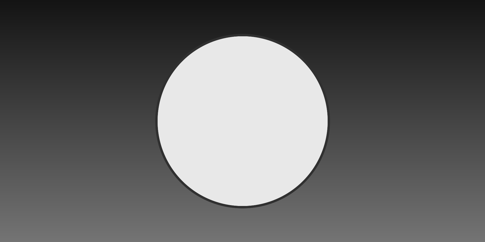

# Image layout regression

## Direct heading

---

## Heading after rule

This paragraph must follow the image with ordinary spacing, not image-sized leading.

## Heading after placeholder

Ordinary ending paragraph.
